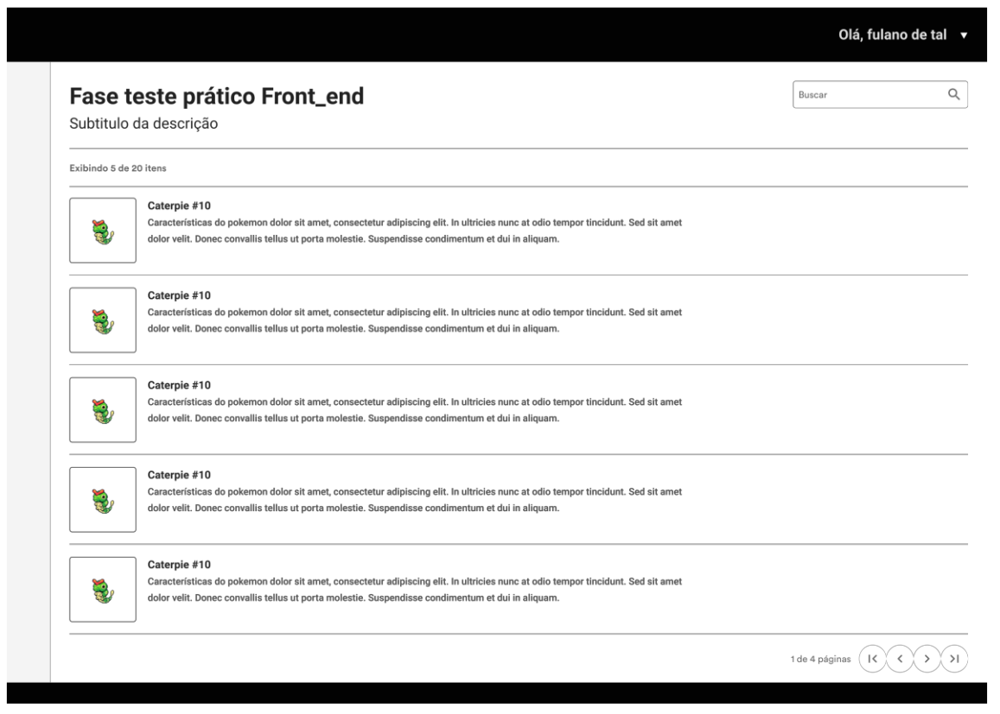
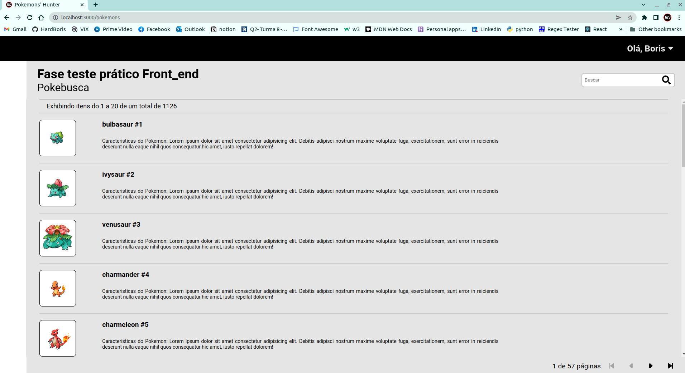
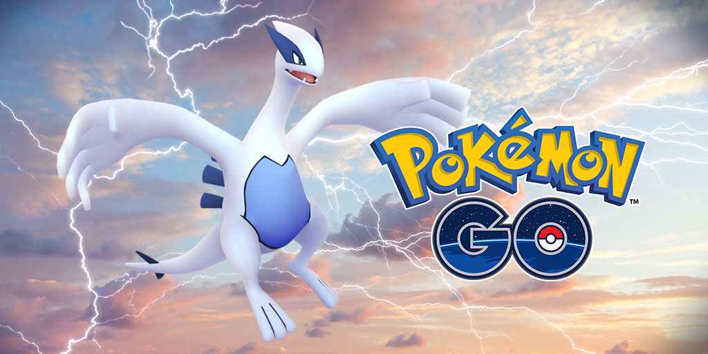
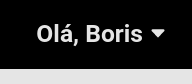
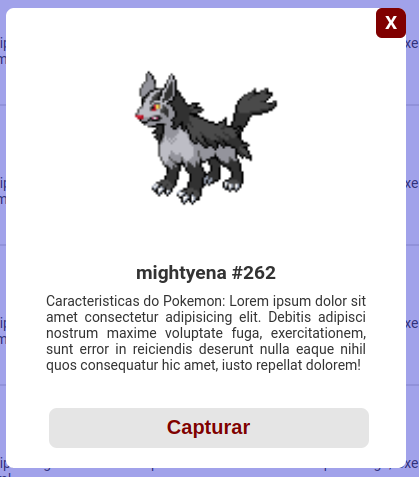
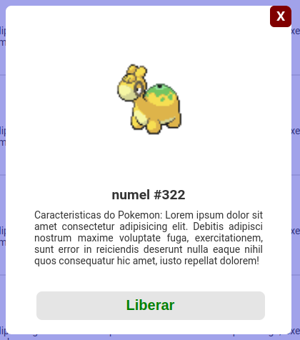
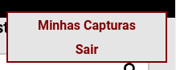
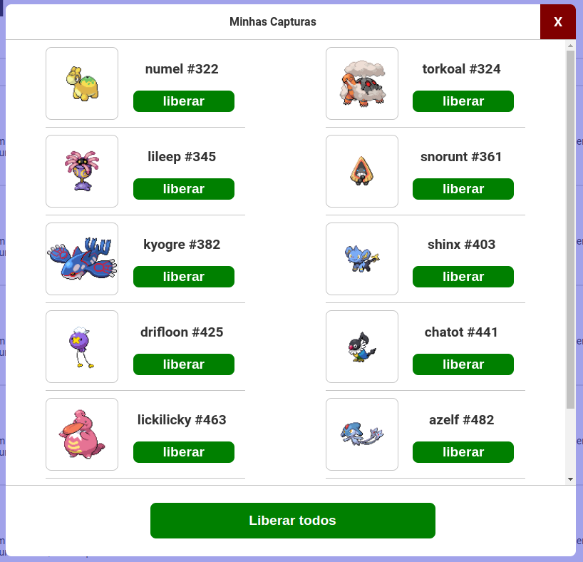

# Pokebusca

[Pokemons](https://pokemon-lyart.vercel.app)

Trabalho encomendado pelo [IATEC](https://www.linkedin.com/company/iatecoficial/) como parte do Teste Técnico para Desenvolvedor Front End.

O Objetivo do trabalho

> é construir uma tela de listagem que apresenta todos os pokémons

tal como indica a imagem 1:

Para alcançar o objetivo, foi utilizado React JS e CSS puro, e o resultado foi como indicado na imagem 2:

Foi providenciado um [style guide no Figma](https://www.figma.com/file/J8M1IeVSd8Nuw6kDTcjPFa/Junior?node-id=0%3A1%20) com todas as explicações necessárias e pertinentes ao projeto, assim, como também toda a informação referente à obtenção dos dados.

## Segunda Milha

O termo "segunda milha" é utilizado nos ambientes cristãos para expressar aquilo que não foi pedido para fazer, mas, é muito bem recebido quando se faz. Neste caso do projeto, se refere a features extras que o desenvolvedor poderia fazer, com o intuito de mostrar iniciativa e dominio das disciplinas testadas: React JS e CSS.

Nos extras implementados neste projeto são:

- Home page, que neste projeto é somente uma imagem promocional do Pokémon Go (imagem 3):
  - 
  - Esta tela se exhibe assim que o usuário entra no site.
  - Tem um botão para iniciar que dispara um modal no qual é solicitado o nome do usuário.
  - Inserir o nome do usuário é obrigatório e não precisa de cadastro previo.
  - Uma vez inserido o nome de usuário, abre a tela como mostrado na imagem 2.
- Pokémons page, é praticamente a página principal.
  - Aqui se cumpre o primeiro requisito do teste, onde no canto superior direito é exhibido o nome do usuário (imagem 4):
    - 
- No campo de busca, foi adicionado um modal com o resultado da pesquisa que apresenta a opção de captura ou liberar o pokémon achado.
- No card de cada pokémon foi adicionado o evento click que dispara outro modal que também apresenta a opção de capturar ou liberar o pokémon. A imagem 5 ilustra o modal de um pokémon livre e a imagem 6 é de um pokémon capturado:
  - 
  - 
- No canto superior direito, logo do lado direito do nome do usuário tem um drop down menu que da acesso ao grupo de pokémons capturados e também à opção de sair da aplicação (imagem 7):
  - 
- Ao acessar "Minhas capturas" é aberto outro modal mostrando os pokémons capturados esperando ser liberados individualmente ou em grupo (imagem 8):
  - 

Elaborar este projeto foi muito bom porque consegui colocar em prática muito dos conceitos aprendidos no curso de 1000 horas de duração ministrado via remota pela [Kenzie Academy Brasil](https://www.linkedin.com/company/kenzie-brasil/?lipi=urn%3Ali%3Apage%3Ad_flagship3_search_srp_all%3BoQHlifLQSGGEyvXnfRWT8w%3D%3D) a quem expresso o meu infinito agradecimento pela minha formação como Desenvolvedor Front End.
